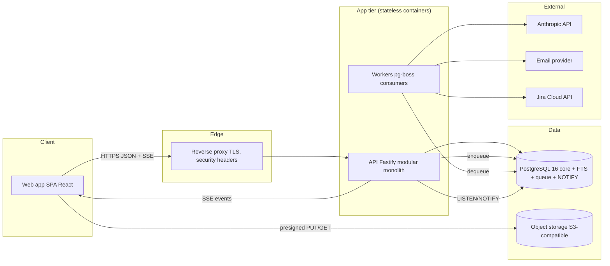
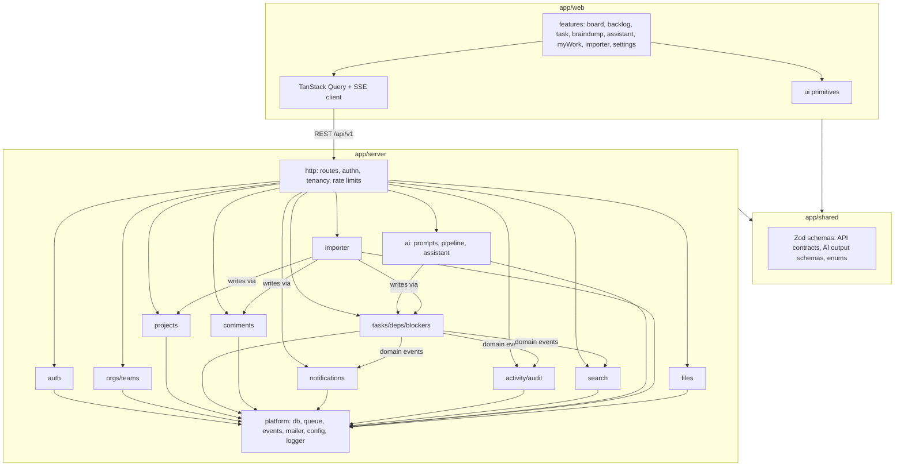
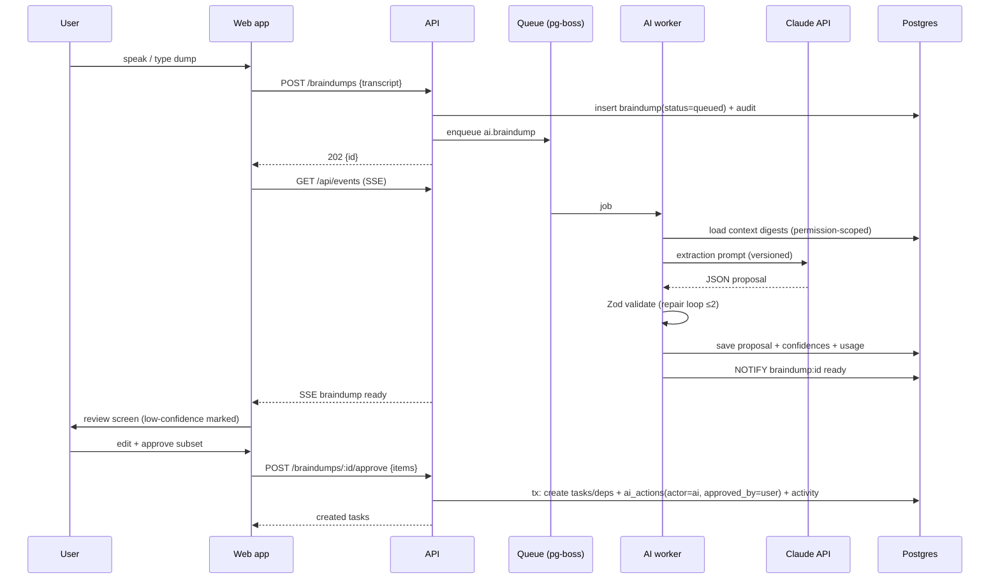
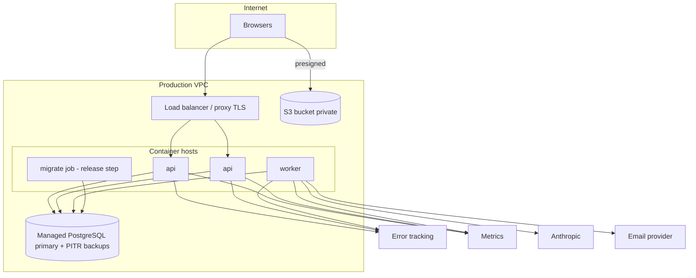

# Outcome — Technical Architecture

**Companion to:** `docs/01-PRD.md`
**Decision baseline:** modular monolith for MVP; the module boundaries are the
future service seams (AI worker, importer) — split only when load proves it.

---

## Stack choice (and why)

| Layer | Choice | Why |
|---|---|---|
| Language | **TypeScript everywhere** (strict) | One language across API/UI/jobs; shared types for the API contract and AI schemas |
| Runtime | **Node.js 22 LTS** | LTS, first-class TS tooling, mature Postgres/queue clients |
| Backend | **Fastify** + **Zod** | Fast, schema-first request/response validation, tiny surface, easy to reason about in a security audit (vs Nest's DI magic) |
| ORM/DB access | **Drizzle ORM** + `pg` | Type-safe SQL that stays SQL (auditable queries, no lazy-loading surprises), first-class migrations |
| Database | **PostgreSQL 16** | Required; also serves FTS (tsvector), queue (SKIP LOCKED), LISTEN/NOTIFY realtime fan-out, pgvector later — one datastore for MVP ops simplicity |
| Frontend | **React 18 + Vite + TypeScript** | Ubiquitous hiring pool; Vite dev speed; SPA is right for an app behind login (no SEO need) |
| Data fetching | **TanStack Query** | Cache, optimistic updates (board drags), retries, SSE-driven invalidation |
| Routing | **React Router v6** | Boring and reliable |
| Styling | **CSS custom properties + hand-rolled design system** (Tailwind acceptable alternative) | Small, auditable, matches the UX spec's token system |
| Background jobs | **pg-boss** (Postgres-backed queue) | No Redis to operate at MVP; transactional enqueue with the business write; swap to BullMQ/Redis when AI volume demands |
| Realtime | **SSE** (`text/event-stream`) fed by Postgres NOTIFY | One-directional updates are all we need (board/notifications); avoids WebSocket infra and auth complexity |
| AI | **Provider abstraction → Anthropic Claude** (default), structured outputs validated by Zod | Latest Claude models for extraction/assistant; abstraction keeps provider swappable and enables the deterministic fake used in tests |
| Files | **S3-compatible object store** (MinIO dev / S3 or R2 prod), presigned URLs | Never stream files through the API process |
| Email | Provider adapter (Resend/SES/postmark) with console adapter in dev | Transactional only at MVP |
| Auth | **Own session auth** (opaque tokens, httpOnly cookies) + Argon2id | Sessions beat JWTs for revocation/logout; no third-party auth dependency at MVP; OAuth added post-MVP |
| Monorepo | **npm workspaces**: `app/server`, `app/web`, `app/shared` | Shared Zod schemas = one source of truth for API + AI contracts |

Rejected alternatives, briefly: **Next.js** (SSR adds complexity with no SEO
payoff behind login), **NestJS** (heavier abstraction than a security-audited
MVP wants), **Prisma** (runtime engine + query opacity vs Drizzle),
**microservices** (team of 1–5 building an MVP: operational tax without scale
evidence), **Redis at MVP** (one more stateful service; pg-boss suffices).

---

## 1. Frontend architecture

- SPA in `app/web`; feature-folder structure (`features/tasks`, `features/board`,
  `features/braindump`, …) over a thin `ui/` primitive library (Button, Dialog,
  Menu, Field, Skeleton, Toast, EmptyState).
- Server state exclusively via TanStack Query (`queryKey` = REST path);
  optimistic mutations for board drag, status, assignee; rollback on error.
- Client state (dialogs, selection, capture recorder) in small Zustand stores.
- SSE client subscribes to `/api/events` and invalidates affected query keys
  (`task:123 changed` → invalidate `['tasks', projectId]`, `['task', 123]`).
- Route-level code splitting; skeletons per UX spec; error boundaries per route.
- Accessibility: focus management in dialogs, full keyboard board (arrow keys +
  space to lift/drop), ARIA live region for toasts/AI progress.

## 2. Backend architecture (modular monolith)

```
app/server/src/
  modules/
    auth/          sessions, password, invitations
    orgs/          organizations, teams, members, roles
    projects/      projects, statuses, members
    tasks/         epics, tasks, subtasks, labels, dependencies, blockers
    comments/
    notifications/ fan-out + preferences + email rendering
    activity/      per-entity timelines + org audit log (append-only)
    search/        FTS queries + index maintenance
    ai/            provider abstraction, prompt registry, braindump pipeline, assistant
    importer/      jira import state machine
    files/         presigned upload/download, attachment records
  platform/        db, queue, mailer, events (NOTIFY), config, logger, errors
  http/            fastify app, route registration, auth/tenancy/rbac hooks, rate limits
```
Rules: modules expose a typed service interface; cross-module calls go through
those interfaces (no reaching into another module's tables); every service
method takes a `Ctx { orgId, userId, role, tx? }` — tenancy is an argument, not
ambient state. HTTP layer does parsing/authn; services do authz + logic.

## 3. Database architecture

Single Postgres; schema detailed in `docs/03-DATABASE.md`. Principles:
- `org_id` on every tenant row + composite indexes leading with `org_id`;
  Postgres **RLS enabled as defense-in-depth** (app sets `app.org_id` per tx).
- Soft delete (`deleted_at`) for user-facing entities; hard delete for sessions/tokens.
- Append-only `activity_events` (audit + timelines), monthly partition-ready.
- Generated `tsvector` columns for search on tasks/projects/comments.
- Keyset pagination everywhere (`(created_at, id)` cursors).
- pg-boss tables in a separate `pgboss` schema; migrations via Drizzle SQL files.

## 4. API architecture

- REST, JSON, under `/api/v1`; resources mirror the domain
  (`/orgs/:orgId/projects/:id/tasks`…). Verbs: standard CRUD + action posts
  (`POST /tasks/:id/dependencies`, `POST /braindumps/:id/approve`).
- Every route declares Zod schemas (params/query/body/response) from
  `app/shared` — the same types the frontend imports; OpenAPI generated from them.
- Errors: RFC-7807-style `{ type, title, status, detail, fields? }`; error codes
  stable for the client; no stack traces to clients.
- Auth: session cookie (browser) or `Authorization: Bearer <api-token>` (API);
  CSRF: SameSite=Lax + double-submit token on state-changing browser calls.
- Rate limits per user+IP tiered: auth endpoints strict, AI endpoints
  budgeted, general API generous. Idempotency keys accepted on POSTs that
  create (import, approve-braindump).

## 5. Authentication architecture

- Argon2id password hashes (tuned params); constant-time comparisons.
- Opaque 256-bit session tokens, stored hashed (SHA-256) in `sessions` with
  user agent/IP metadata; httpOnly, Secure, SameSite=Lax cookie; 30-day rolling
  expiry, absolute 90-day cap; server-side revocation (logout-all).
- Email verification + password reset via single-use hashed tokens (TTL).
- Login throttling (per-account + per-IP backoff) and generic error messages.
- Personal API tokens: `outc_` prefixed, shown once, stored hashed, org-scoped
  with role ≤ owner's role, revocable, last-used tracked.

## 6. Authorization / RBAC

- Roles per PRD §12: org(owner/admin/member) × project(lead/member/viewer).
- Single `can(ctx, action, resource)` policy module — the only place rules
  live; services call it before mutations and scope reads by membership joins.
- Tenancy invariant: every query goes through repository helpers that require
  `orgId`; RLS backstops mistakes. AI retrieval and search run through the
  same repositories, so the assistant cannot read what the caller cannot.

## 7. AI architecture

```
caller → ai/service (budget, redaction, audit)
           → prompt registry (versioned templates)
           → provider adapter (Anthropic | Fake)
           → structured-output validator (Zod schema, repair loop ≤2)
           → result + confidence + token usage → audit log
Long-running (braindump, assistant tools) run as pg-boss jobs; progress
streamed to the client via SSE; results persisted (ai_conversations,
ai_messages, braindumps, ai_actions).
```
- **Fake provider** (deterministic, fixture-driven) powers tests and offline
  dev; selected by `AI_PROVIDER=fake`.
- Guardrails: max input tokens per dump; org-level daily budget; retrieved
  task content is wrapped as data ("quoted context"), never as instructions;
  tool allowlist per conversation; mutations require explicit user
  confirmation recorded on the `ai_actions` row.

## 8. Prompt architecture

- Prompts are code: `modules/ai/prompts/*.ts`, versioned (`braindump@3`),
  each exporting: system template, user template builder, Zod output schema,
  few-shot examples, and eval fixtures. The audit log records prompt version.
- Extraction prompts demand: JSON only, per-field confidence, explicit
  `ambiguities[]` and `questions[]`, `duplicates[]` referencing provided
  existing-task digests; "if unsure, mark low confidence — do not guess."
- Assistant prompts inject: role-scoped context digests with task IDs, the
  tool list, and the fact/recommendation separation instruction; citations are
  validated server-side (IDs must exist and be readable) before rendering.

## 9. Background job architecture

- pg-boss queues: `email`, `ai.braindump`, `ai.assistant`, `import.jira`,
  `search.reindex`, `notifications.digest`.
- Jobs enqueued in the same DB transaction as the triggering write.
- Retry with exponential backoff + dead-letter table surfaced in admin;
  idempotent handlers (job carries entity IDs, not payloads-of-truth).
- Import runs as a resumable state machine persisted in `import_runs` /
  `import_items` (per-record status → retryable).

## 10. Notification architecture

- Domain events (task.assigned, comment.mentioned, blocker.created, …) emitted
  by services → notifications module maps event × recipient prefs →
  `notifications` rows (+ NOTIFY for SSE inbox) and/or `email` jobs.
- Batching: importer and bulk actions emit collapsed events; digest job rolls
  up unread items daily per user preference. Unsubscribe = signed link to prefs.

## 11. Search architecture

- MVP: Postgres FTS — generated `search` tsvector columns (title weight A,
  body B), GIN indexes; one `/search` endpoint federating tasks/epics/
  projects/comments with permission-scoped subqueries + filter grammar parsed
  server-side. Typeahead uses `websearch_to_tsquery` + trigram fallback.
- Post-MVP: pgvector embeddings table per entity for semantic + assistant
  retrieval; same permission scoping.

## 12. File storage architecture

- Client asks `POST /attachments` → server validates type/size, creates row
  (status=pending), returns presigned PUT URL → client uploads → client
  confirms → server HEADs object, marks ready. Downloads via short-lived
  presigned GETs. Buckets private; keys `org/{orgId}/task/{taskId}/{uuid}`;
  optional AV-scan job hook before "ready". MIME allowlist + 25 MB default cap.

## 13. Integration architecture

- Importer module with source adapters (Jira first): fetch → normalize to an
  internal interchange shape → mapping (user-reviewed) → dry-run diff →
  transactional batch writes with per-item results. Credentials encrypted
  (AES-256-GCM, key from KMS/env) in `integrations`.
- Outbound webhooks (post-MVP): signed (HMAC), retried, per-org endpoints.

## 14. Observability

- **Logs:** pino JSON with `req_id`, `org_id`, `user_id` (never tokens/PII
  bodies); request/response summary line per call.
- **Metrics:** OpenTelemetry — HTTP latency histograms, queue depth/lag, AI
  latency/tokens/cost per org, DB pool stats; Prometheus endpoint.
- **Tracing:** OTel spans DB/queue/AI; sampled.
- **Errors:** Sentry-compatible hook (frontend + backend), release-tagged.
- **Health:** `/healthz` (liveness), `/readyz` (DB, queue, object store).

## 15. Error handling

- Typed `AppError` hierarchy (`Validation`, `Auth`, `Forbidden`, `NotFound`,
  `Conflict`, `RateLimited`, `AiUnavailable`…) → one Fastify error mapper.
- Never leak internals; every 5xx gets `req_id` shown to the user for support.
- AI/import failures persist a user-visible failure state with retry action —
  jobs never fail silently. Frontend: route error boundaries, mutation
  rollback toasts, offline banner, form-level field errors.

## 16. Security (build-time posture; full audit in Phase 11)

Threat-model-first: tenant isolation (repos + RLS), RBAC single choke point,
session hardening (§5), CSRF, input validation on 100% of routes, output
encoding via React (+ sanitized markdown rendering — no raw HTML), SSRF: no
user-supplied URL fetches at MVP except Jira base URL (validated, allowlisted
schemes, no redirects to private ranges), upload restrictions (§12), rate
limits (§4), secrets only via env/manager, dependency audit + lockfiles in CI,
prompt-injection posture (§7), immutable audit log, security headers (CSP,
HSTS, frame-deny) at the edge and app.

## 17. Scalability

Stateless API (sessions in DB) → horizontal scale behind LB; queue workers
scale independently (same image, `ROLE=worker`); Postgres: start single node +
PITR, add read replicas for search/analytics, partition `activity_events` and
`notifications` by month when needed; SSE fan-out via NOTIFY works to ~10k
concurrent connections per node — move to a pub/sub tier when exceeded; AI
throughput governed by queue concurrency + per-org budgets. The module seams
(ai, importer) are the first extraction candidates.

## 18. Deployment architecture

- One container image, three roles: `api`, `worker`, `migrate` (entrypoint arg).
- `docker-compose.prod.yml`: api ×N, worker ×N, Postgres (or managed RDS/
  Cloud SQL — preferred), MinIO/S3, reverse proxy (Caddy/nginx) terminating
  TLS with security headers.
- Environments: dev (compose, fake AI, console mail), staging (prod-shaped,
  real AI with low budget), production. Migrations run as a release step
  (`migrate` role) before rollout; app boots only when schema version matches.

## 19. CI/CD

GitHub Actions: on PR — install, typecheck, lint, unit tests, integration
tests against service-container Postgres, build, `npm audit` + secret scan;
on main — additionally build/push image (SHA + latest tags), deploy to
staging, smoke test (`/readyz` + login + task create), manual approval gate →
production deploy (migrate → rolling restart), post-deploy smoke; rollback =
redeploy previous image tag (migrations are expand/contract, backward-compatible one release).

## 20. Environment configuration

Single typed config module parsing env via Zod at boot (fail-fast with clear
message). Keys (see `.env.example`): `DATABASE_URL`, `SESSION_SECRET`,
`APP_URL`, `PORT`, `AI_PROVIDER` (`anthropic|fake`), `ANTHROPIC_API_KEY`,
`AI_DAILY_BUDGET_USD`, `S3_*`, `SMTP_*`/`EMAIL_PROVIDER`, `RATE_LIMIT_*`,
`LOG_LEVEL`, `SENTRY_DSN`, `COOKIE_SECURE`. No secrets in the repo; distinct
values per environment; config printed at boot with secrets redacted.

---

## System architecture diagram



## Component diagram



## Data-flow diagram — brain dump



## Deployment diagram


