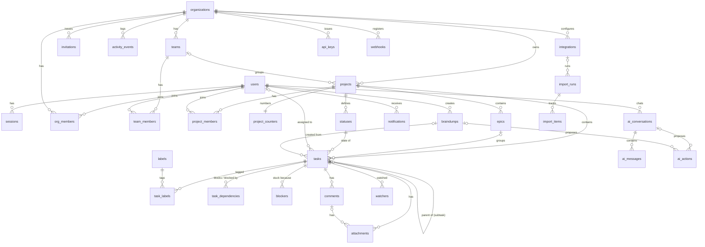

# Outcome — Database Design (PostgreSQL 16)

**Authoritative DDL:** `app/server/db/migrations/0001_init.sql` (core schema),
`0002_search.sql` (FTS), `0003_rls.sql` (row-level security),
`0004_login_attempts.sql` (login throttling), `0005_rls_fix_empty_setting.sql`
(fail-closed org context), `0006_ai_usage.sql` (atomic AI budget). This
document explains the design; the migrations are the exact
column/type/index/constraint spec and are runnable as-is.

## Design principles

1. **Multi-tenancy & isolation.** Every content row carries `org_id`
   (denormalized even where derivable) so (a) all hot indexes lead with
   `org_id`, and (b) fail-closed Postgres RLS (`0003_rls.sql`) can enforce
   isolation per transaction via `SET LOCAL app.org_id = …`, backstopping the
   application's org-scoped repositories. Join tables without `org_id`
   (`task_labels`, `watchers`, …) get EXISTS-based policies through their
   parent. Identity tables (`users`, `sessions`, `organizations`,
   `org_members`, `invitations`, `auth_tokens`, `api_keys`) are pre-context
   (login, org switcher) and are app-enforced only — deliberately documented.
2. **Query performance.** Composite partial indexes for the hot paths: board
   (`org_id, project_id, status_id WHERE deleted_at IS NULL`), My Work
   (`org_id, assignee_id`), inbox (`user_id, created_at DESC` + unread
   partial), open blockers, due dates. Keyset pagination on
   `(created_at, id)`; `position double precision` for O(1) drag reordering
   (midpoint insertion, periodic rebalance).
3. **Auditability.** `activity_events` is append-only (`GENERATED ALWAYS`
   identity, no UPDATE path in app code) and records `actor_type ∈ user|ai|
   system`. AI provenance is first-class: `tasks.source`, `tasks.braindump_id`,
   and `ai_actions` (proposed → approved → executed, with the approving human).
4. **Soft delete** (`deleted_at`) on user-facing entities — users, orgs,
   teams, projects, epics, tasks, comments, integrations, webhooks — with
   partial unique indexes so names/keys can be reused after deletion. Hard
   delete for security artifacts (sessions, auth tokens) and cascades. A
   30-day purge job hard-deletes soft-deleted rows.
5. **Scalability.** `activity_events` and `notifications` are the growth
   tables: bigint identity + time-leading secondary indexes make them
   month-partitionable without app changes. Search is generated-column FTS
   (no external engine to operate); pgvector can be added as a sibling table
   later. Queue (pg-boss) lives in its own schema in the same instance until
   volume argues otherwise.
6. **Enums as `text + CHECK`** — evolvable without `ALTER TYPE` locks.
7. **Task numbering** (`ATLAS-42`) via `project_counters` row locked in the
   creating transaction — gapless per project, no sequence-per-project sprawl.
8. **Counters, not row counts, for quotas.** `ai_usage_daily` holds one row per
   (org, UTC day) so the daily AI budget is reserved by a single upsert that
   increments and returns the new total. Counting rows and then writing one is
   a check-then-act race, and making it atomic would mean holding a lock across
   the model call — serializing every AI request in the org behind a network
   round trip.

## Table inventory (details in `0001_init.sql`)

| Area | Tables |
|---|---|
| Identity | `users`, `sessions`, `auth_tokens` |
| Tenancy | `organizations`, `org_members`, `invitations`, `teams`, `team_members` |
| Projects | `projects`, `project_members`, `project_counters`, `statuses` |
| Work | `epics`, `tasks` (subtasks = `parent_id`), `labels`, `task_labels`, `task_dependencies`, `blockers`, `comments`, `watchers`, `attachments` |
| Signal | `notifications`, `notification_prefs`, `activity_events` |
| AI | `braindumps`, `ai_conversations`, `ai_messages`, `ai_actions`, `ai_usage_daily` |
| Integrations | `integrations`, `import_runs`, `import_items`, `api_keys`, `webhooks` |

Notable modeling decisions:

- **Subtasks are tasks** (`parent_id`), so they get statuses/assignees/search
  for free; app constrains nesting to one level.
- **Dependencies vs blockers are different things:** `task_dependencies` is a
  typed DAG edge (cycle check in service layer via recursive CTE);
  `blockers` is a dated, attributable record of *why* something is stuck
  (reason, expected resolution, resolver) — the raw material for the outcome
  engine and blocker analytics.
- **`statuses` are per-project rows** (seeded from a default set) with a fixed
  `category` — boards group by status, analytics/forecasting group by
  category; custom statuses later need zero migration.
- **Credentials** (`integrations.credentials_encrypted`,
  `webhooks.secret_encrypted`) are AES-256-GCM sealed by the app with a key
  from the environment/KMS — never plaintext at rest, never in `config` jsonb.
- **All tokens stored hashed** (sessions, invitations, auth tokens, API keys);
  plaintext exists only in the initial response/email.

## ER diagram (major entities)

## Migration process

Plain SQL files applied in filename order by the app's migrator
(`app/server/src/platform/migrate.ts`), which records applied files in a
`schema_migrations` table inside a transaction per file. Rules: forward-only;
expand/contract for zero-downtime (add nullable column → backfill → enforce);
never edit an applied file. `npm run db:migrate` locally and as the `migrate`
container role in deployment.
